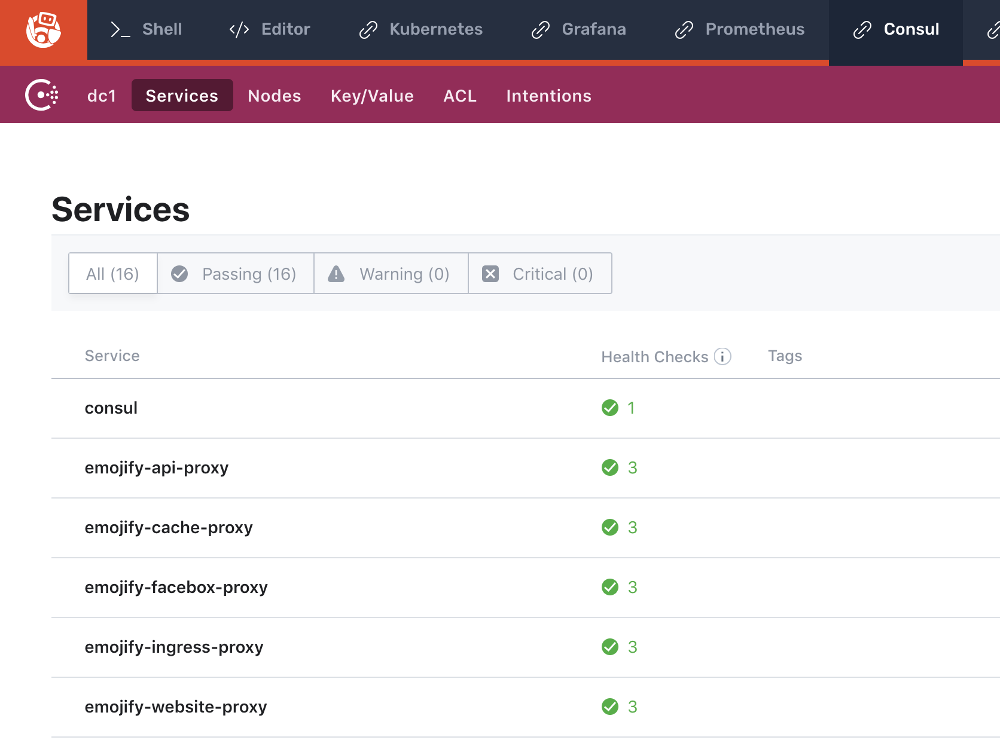

# Lab 02, Exercise 1: Enable Connect Sidecar Injection

**Objective:** Enable Connect sidecar injector by applying updated helm chart.

## Background

[Connect](/docs/connect/index.html) is a feature built into to Consul that
enables automatic service-to-service authorization and connection encryption
across your Consul services. Connect can be used with Kubernetes to secure pod
communication with other pods and external Kubernetes services.

The Connect sidecar running Envoy can be automatically injected into pods in
your cluster, making configuration for Kubernetes automatic.  This
functionality is provided by the [consul-k8s
project](https://github.com/hashicorp/consul-k8s) and can be automatically
installed and configured using the [Consul Helm
chart](/docs/platform/k8s/helm.html).

## Step 1: Inspect updated configs

First, navigate to this exercise's directory:

```
cd ~/service-mesh-training/exercises/lab-02/01-enable-connect-inject/
```
Take a look at the updated Kubernetes config files in `files/app`.

Here we've added [annotations](https://kubernetes.io/docs/concepts/overview/working-with-objects/annotations/) which:

* inject enjoy into every pod: `"consul.hashicorp.com/connect-inject": "true"`
* configure upstream connections
  * api.yml: `"consul.hashicorp.com/connect-service-upstreams": "emojify-facebox:8000,emojify-cache:8001"`
  * ingress.yml: `"consul.hashicorp.com/connect-service-upstreams": "emojify-website:8000,emojify-api:8001"`

Once applied, Envoy will be injected into every pod and will handle all traffic between pods via localhost proxies. The API service will be able to connect to upstream services `emojify-faceboox` and `emojify-cache`. The ingress will be able to connect to upstream services `emojify-website` and `emojify-api`.

TODO: add diagram here

## Step 2: Apply updated chart / configs

Now apply the updated config files:

```
kubectl apply -f files/app

service/emojify-api-service created
deployment.apps/emojify-api created
service/emojify-cache-service created
deployment.apps/emojify-cache configured
service/emojify-facebox-service created
deployment.apps/emojify-facebox configured
configmap/emojify-ingress-configmap configured
deployment.apps/emojify-ingress configured
secret/emojify unchanged
configmap/emojify-website-configmap unchanged
service/emojify-website-service created
deployment.apps/emojify-website configured
```

## Step 3: Verify connect sidecars injected and running

Take a look at the **Consul** tab. You should see the Kubernetes pods listed under services:


